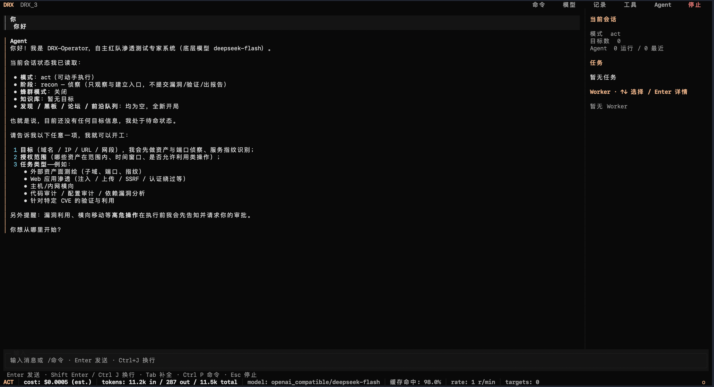

# DRX-Operator

[English](README.md) | [简体中文](README-zh.md)

An autonomous red-team penetration testing expert system — an **Agent-First**, LLM-driven autonomous security testing platform.

**Tips: Due to the performance limitations of the Python version, this project currently serves only as an early proof-of-concept. The next-generation DRX-Operator-Go will deliver a more powerful swarm-based multi-Agent collaboration architecture, higher concurrent execution capabilities, and a significantly higher overall performance ceiling.**

[Python 3.10+] [Alpha]

**Author**: [BushSEC](https://github.com/BushANQ) · [bushsec.cn](https://bushsec.cn)



---

DRX-Operator is an autonomous penetration testing system built around an **Agent-First architecture**. Unlike traditional security tools, the core of DRX-Operator is an LLM-powered **Master Agent** that autonomously makes decisions, invokes toolchains, analyzes results, and continuously executes security testing tasks through a ReAct (Reasoning + Acting) loop.

The terminal interface (TUI) is merely a thin presentation layer. The Agent is a first-class citizen of the system — **all operations are performed through LLM tool calls**.

DRX-Operator includes built-in Python/Bash sandboxes, persistent shell session management, OOB callback listeners, MCP protocol extensions, a declarative permission engine, a five-level safety gating system, an evidence-driven vulnerability discovery model, and a seven-layer context compaction pipeline designed to support extremely long-running red-team sessions.

**This tool is intended exclusively for authorized security testing. Unauthorized access to systems you do not own or have explicit permission to test may be illegal. Before using DRX-Operator, ensure that you have obtained written authorization from the owner of the target system.**

---

## Table of Contents

* [Core Features](#core-features)
* [Installation and Configuration](#installation-and-configuration)
* [Quick Start](#quick-start)
* [Architecture Overview](#architecture-overview)
* [Tool Reference](#tool-reference)
* [Roadmap](#roadmap)
* [Disclaimer](#disclaimer)

---

## Core Features

**Autonomous ReAct Decision Loop** — A five-stage reasoning cycle consisting of Plan, Think, Act, Observe, and Reflect. The Agent continuously adapts its strategy based on real-time tool outputs without requiring manual intervention.

**30+ Built-in Tools** — HTTP fetching, Bash/Python sandbox execution, persistent shell sessions (SSH/reverse shells), OOB callback listeners, NVD CVE lookup, web search, file read/write and precise editing, structured parsing (nmap XML and raw HTTP), and wordlist management.

**Evidence-Driven Vulnerability Discovery** — Every Finding includes an Evidence array, confidence score, `verified` field, and optional CVE association. Conclusions must be based on concrete data returned by tools; unsupported or hallucinated findings are prohibited.

**Five-Level Safety Gating** — From L0 (reconnaissance, automatically approved) to L4 (destructive operations requiring a confirmation phrase), combined with a declarative `PermissionEngine` based on ordered glob-style `allow` / `ask` / `deny` rules, where the first matching rule takes effect.

**MCP Protocol Support** — External tool servers integrate through the Model Context Protocol. Tools use `mcp__<server>__<tool>` names and are exposed and executable only in the `research` stage; unknown external side effects are not granted to the other stages.

**Configurable Roles and Bounded Parallel Dispatch** — 15 built-in roles, including code review, dependency/configuration audit, planning, and critical review. Roles set real prompts, tool grants, TTLs, and iteration budgets. The shipped configuration allows batches of 8, up to 16 workers globally and 4 per target, with cancellation-safe waiting and rate-limited admission.

**Unanimous Team Ballots** — Frozen stage membership, explicit approve/reject/abstain votes, deadlines, and state-fingerprint invalidation. Completed workers are consulted through fresh model requests using their own task/result context. Unanimity is an additional completion/transition gate, never proof that a vulnerability is real.

**Project-Scoped Long-Term Memory** — Persistent Playbook candidates, explicit admission, content-based lexical retrieval, provenance, revision/TTL filtering, negative memories, invalidation, and conservative duplicate consolidation. Retrieved experience is reference data, not a permanent instruction or a verified finding.

**Session Persistence** — Atomic SQLite snapshots save the knowledge base, message history, collaboration state, stage, todo list, usage statistics, stage-member contexts, and ballot history together. Restore drains old execution before replacing state and requeues orphaned work without refunding consumed steps. It does not automatically replay worker actions or model votes. Existing JSON-sidecar sessions remain readable.

**LLM Resilience Layer** — Exponential-backoff retries plus Provider fallback chains. HTTP 429, 5xx, and connection-related errors are retried automatically. If retries are exhausted, the system automatically switches to the next Provider, while the UI displays the failover status in real time.

**Seven-Layer Context Compaction Pipeline** — From L1 (automatic archival of large tool outputs) through L7 (cross-Agent artifact sharing), enabling tens of thousands of interaction turns within a single session without exceeding the model's context window.

**Terminal Interface (Textual TUI)** — A black, conversation-first workspace with a continuously rotating activity indicator, multiline editing, independent approval dialogs, searchable lossless history, an optional Agent inspector, and live usage metrics. Press `Esc` or `Ctrl+S` to interrupt work.

---

## Installation and Configuration

### Prerequisites

* Python 3.10 or later
* Optional system tools that the Agent may invoke when needed: `nmap`, `curl`, `git`, `ssh`, `openssl`, etc.

### Install from Source

```bash
git clone https://github.com/BushANQ/DRX-Operator.git
cd DRX-Operator
pip install -r requirements.txt
```

Major Python dependencies include:

* `textual` — TUI framework
* `ddgs` — web search
* `requests` / `urllib3` — HTTP requests
* `anthropic` / `openai` — LLM Providers
* `pyyaml` — skill configuration parsing

### Configure the LLM

**Step 1 (required): Configure your API key through environment variables.**

The repository's `configs/default_config.json` is a clean template with an empty `api_key` field. **Do not store API keys in any file that may be committed to version control.**

Recommended setup:

```bash
cp .env.example .env       
# Edit .env and add your API key, for example:
#   DRX_LLM_API_KEY=sk-xxxxxxxx
set -a && source .env && set +a    
```

API key resolution priority:

`DRX_LLM_API_KEY` > Provider-specific environment variable (see below) > `api_key` field in the configuration file.

**Step 2 (optional): Configure the Provider / model.**

Edit the `llm` section in `configs/default_config.json`. Only modify non-sensitive fields such as `provider`, `model`, `base_url`, and `temperature`:

```json
{
  "llm": {
    "enabled": true,
    "provider": "openai_compatible",
    "model": "deepseek-chat",
    "api_key": "",
    "base_url": "https://api.deepseek.com",
    "temperature": 0.7,
    "context_window": 65536,
    "retry": {
      "max_retries": 3,
      "base_delay": 1.0,
      "max_delay": 30.0
    },
    "fallback": []
  }
}
```

Output budgets use model capabilities and endpoint policy, not a universal 4096-token default. Omit `llm.max_tokens` or set it to `null` to select the model default; an explicit number requests a cap, still bounded by the model and endpoint. Unknown manually configured models use a 16384-token output capability. Set `llm.model_max_tokens` to declare a custom model's actual output capability; `context_window` remains a separate context-management setting.

- Chat Completions and Responses normally clamp output to 64000 tokens or the model's smaller limit. Native DeepSeek Flash, Moonshot Kimi K3 and selected GLM endpoints use their declared model caps instead. The default `deepseek-v4-pro` configuration sends **`max_tokens: 64000`**.
- OpenRouter omits automatic catalog caps to avoid excluding upstreams; explicit caps are retained, and Kimi models still receive required caps.
- Native Anthropic Messages automatically receives its required `max_tokens`, using the model capability rather than requiring a separate setting. API-key requests are not subject to the OAuth-only 64000-token ceiling.
- Responses requests targeting the Codex endpoint omit output caps. This does not add a Codex login or transport implementation.

For custom gateways, `llm.max_tokens_field` can select `max_tokens` or `max_completion_tokens` for Chat Completions; Responses uses `max_output_tokens`. `llm.always_send_max_tokens` overrides required-cap detection, and `llm.clamp_output_to_model_max` selects the model ceiling instead of the normal 64000 ceiling. `llm.omit_max_output_tokens: true` suppresses optional output fields even when a cap was explicitly set; it does not suppress Anthropic's required field. Model-serving limits and server defaults still apply.

Supported Provider types:

| `provider` value              | Provider implementation | Environment variable |
| ----------------------------- | ----------------------- | -------------------- |
| `anthropic` or `claude`       | AnthropicProvider       | `ANTHROPIC_API_KEY`  |
| `openai`                      | OpenAIProvider          | `OPENAI_API_KEY`     |
| `openai_compatible` (default) | DeepSeekProvider        | `DEEPSEEK_API_KEY`   |

**Fallback chain** (optional): automatically switch Providers when the primary Provider becomes unavailable.

```json
{
  "fallback": [
    {
      "provider": "openai",
      "model": "gpt-4o",
      "api_key": "",
      "base_url": "https://api.openai.com/v1"
    }
  ]
}
```

### Configure Collaboration

The top-level `collaboration` section in `configs/default_config.json` controls these features:

```json
{
  "collaboration": {
    "batch_size": 8,
    "max_intents": 512,
    "scheduler": {
      "max_concurrent": 16,
      "max_concurrent_per_target": 4,
      "global_qps": 8
    },
    "voting": {"enabled": true, "timeout_s": 180},
    "roles": {
      "code_review": {"max_iterations": 20, "ttl": 600},
      "api_contracts": {
        "description": "Read-only API contract review",
        "system_prompt": "Compare documented API contracts with source evidence; report mismatches.",
        "tools": ["read_file", "grep", "read_artifact", "memory_search", "memory_get"],
        "max_iterations": 16,
        "ttl": 300,
        "parallel_tool_calls": true
      }
    },
    "memory": {
      "enabled": true,
      "path": ".drx/memory.json",
      "max_entries": 1000,
      "top_k": 5,
      "prompt_chars": 3000,
      "revision": ""
    }
  }
}
```

`batch_size` must fit `max_concurrent`. Saturated targets wait without blocking unrelated targets; cancellation releases admission capacity. `global_qps` limits **worker and vote-request admission**, not every HTTP request or tool invocation. Set it to `null` to disable rate limiting while retaining concurrency caps. A full Frontier evicts terminal records only, or explicitly refuses new work when all records are unfinished.

Built-in role overrides inherit omitted fields. Custom roles require `description`, `system_prompt`, and `tools`; `tools: []` grants no tools, while `null` adds no role-specific restriction. Stage, plan-mode, runtime identity, and Master-only restrictions still apply. Role TTLs must be 1–3600 seconds and iteration budgets 1–100. Roles currently share the configured provider; selecting a role does not select another model.

The shipped configuration enables unanimous gating. Existing configurations without `collaboration.voting.enabled` retain the original termination policy; add `true` to opt in. Ballot collection makes one additional model request per participating worker, subject to the scheduler and deadline.

### Configure MCP Servers (Optional)

Add MCP server definitions under `mcp.servers` in `configs/default_config.json`:

```json
{
  "mcp": {
    "servers": {
      "filesystem": {
        "enabled": true,
        "command": "npx",
        "args": ["-y", "@modelcontextprotocol/server-filesystem", "/tmp"],
        "timeout": 30.0
      }
    }
  }
}
```

At startup, DRX-Operator connects to MCP servers with `enabled: true` in the background without blocking terminal input. Connected tools become available in the `research` stage using this naming convention:

```text
mcp__<server_name>__<tool_name>
```

### Launch

```bash
python -m drx_agent.main
```

---

## Quick Start

### Interface Layout

The workspace uses a near-black background with warm accents, inspired by OpenCode's conversation-first layout:

* **Toolbar**: opens commands, conversation records, and the task dashboard; the Stop button interrupts the current task.
* **Conversation**: shares one event-backed history with the transcript viewer. Tool titles display paths and bracketed text literally; errors expand without interpreting their contents as markup. Only a bounded window of cards and bounded message previews are rendered. Older/newer navigation retains access to history; full tool inputs and outputs open in scrollable pages, and copy actions always use the complete original text.
* **Agent inspector**: hidden by default to leave room for conversation. `Ctrl+B` opens it; below 100 columns it replaces the conversation rather than squeezing both. Select a worker and press Enter to inspect its task, target, tools, result, or error. Large details use a bounded preview with **完整详情** for paginated inspection and **复制详情** for the full original. Visibility choices survive resizing.
* **Activity bar**: rotates every 100 ms even before the first model token. It shows the real running/waiting/stopping phase, elapsed time, output age, and active worker/ballot counts. It stops when work finishes or cancellation cleanup completes; it does not invent a completion percentage.
* **Composer and status bar**: a multiline editor grows within a bounded height while mode, cost, and token usage remain visible. Less important controls and metrics are hidden in narrow terminals.

Scrolling up suspends automatic following. New or updated messages are counted by **回到最新**; clicking it or pressing `Ctrl+L` returns to the latest output and resumes following.

### Runtime deadlines and cancellation

* HTTP/search/CVE, file I/O, and regex tools run in owned helper processes with a default 30-second total deadline, rather than relying on socket inactivity timeouts. Cancellation terminates the helper and joins cleanup. FIFO/device files are rejected; pathological regex computation cannot hold the terminal's Python GIL.
* Worker TTL covers active model calls and tool execution, not just time between turns. Expiry drains cancellation before releasing worker capacity and leases. Completed sibling tool results are retained, and interrupted calls receive matching results so the next model request has valid history.
* Compaction uses the model-call deadline. `/dream` participates in the same stop/restore barrier as chat; `/stop` cancels active and queued requests from that session. Failed or interrupted compaction retains the previous progress document.
* Command hooks run asynchronously with their configured timeout. In-process `HookManager.register()` now accepts only cooperative async callbacks: they must yield and propagate cancellation. Move blocking/synchronous callbacks to `register_command()`; detaching an unkillable Python thread is not supported.
* MCP request deadlines include stdin write/drain and reply waits. Cancelling startup closes a spawned server even before it is registered. Sandbox, hook, MCP, and PTY cleanup terminates owned POSIX process groups with a short TERM grace before KILL and reaping.

Deadlines trigger cancellation, not an unconditional wall-clock bound on OS cleanup. Descendants that deliberately escape the owned process group, change privileges beyond the caller's authority, or remain in uninterruptible kernel I/O cannot be guaranteed terminated; permission failures are reported. Windows process cleanup is limited to the direct child.

File mutations publish through atomic replacement, preserving checked ownership/mode and available extended metadata: native ACLs, xattrs/resource forks and file flags on macOS; kernel-enumerated xattrs including ACLs on Linux. Preservation errors reject publication. macOS compressed files and resource forks over 4 GiB, and existing-file metadata preservation on other operating systems, are unsupported. Replacement creates a new inode: other hardlink aliases keep their old contents; inode identity/birthtime and Linux inode ioctl flags are not preserved. A forcibly killed writer may leave a hidden temporary file, but does not publish a partially written target.

### Prompt caching and usage

Master keeps policy and project instructions in a stable system prefix. Live knowledge, notes, collaboration state, and retrieved context are appended as complete snapshots only when they change; the latest snapshot supersedes older state. Worker policies precede task-specific context, without sharing private histories or identities. Compaction, explicit project-instruction reloads, and changed tool grants can legitimately invalidate a prefix.

`F2` shows measured input-token cache reuse, known/unknown input coverage, missing-usage requests, and breakdowns by model and worker role (`master` and `compaction` are separate categories). `unavailable` means the provider did not supply enough data; `partial` means the ratio covers only reported input. Missing usage is not treated as zero, and token totals do not guess unreported amounts. Legacy sessions retain historical totals but their old cache/cost figures are not mixed into corrected measurements.

Costs are estimates for the known-priced portion, with cached reads and writes accounted for separately where reported. Unknown models or custom endpoints are not assumed free. DeepSeek estimates use the UTC pricing tier at usage-recording time, which may differ from invoice timing. OpenAI/DeepSeek native caching is automatic; native Anthropic requests enable automatic caching, while custom Anthropic endpoints receive no unsupported cache-control extension. Provider caches remain best-effort: a stable prefix does not guarantee a hit. See [DeepSeek caching](https://api-docs.deepseek.com/guides/kv_cache) and [Anthropic caching](https://platform.claude.com/docs/en/build-with-claude/prompt-caching).

### Keyboard and Navigation

| Shortcut | Action |
| --- | --- |
| `Ctrl+P` / `F1` | Search command names and descriptions; use arrows and Enter to choose |
| `Alt+M` | Open the searchable model picker with a provider filter |
| `Ctrl+T` | Search messages, full tool inputs/results, approvals, and worker records |
| `Ctrl+B` | Toggle the task/Agent dashboard |
| `Ctrl+L` | Return to the latest conversation output |
| `F2` | Open live usage and activity metrics; the status indicator also supports click, Enter, and Space |
| `Ctrl+S` | Interrupt the current task |
| `Enter` | Send the current message |
| `Shift+Enter` / `Ctrl+J` | Insert a newline; terminal paste preserves literal multiline text |
| `Up` / `Down` in the composer | Navigate visible command suggestions; otherwise browse history only at the visual top/bottom |
| `Tab` after a slash-command prefix | Complete the highlighted suggestion and cycle matching commands |
| `Esc` | Dismiss suggestions without clearing input, close a dialog, or restore a displaced draft; otherwise interrupt the current task |
| `Ctrl+Shift+A` | Copy the latest Agent reply |
| `Ctrl+Shift+T` | Copy the full session record |
| `Cmd+C` / `Ctrl+Shift+C` | Copy selected text |

Selecting `/scan`, `/exploit`, or `/target` in the command picker fills the composer without executing an incomplete command. Add the target and press Enter yourself. The picker and editor share command dispatch: `/help` displays local help without interrupting work or requesting a model response.

Typing `/` opens suggestions from the same command registry. Enter completes a highlighted, incomplete command; press Enter again to execute the completed command. `/model` or the **模型** header button opens model selection; search by model/provider/host, filter by provider, and confirm with Enter. Esc cancels without changing the model or losing the editor draft.

Model choices come from configured providers and their model-list APIs, not an invented global catalog. Configured/current choices remain available when discovery is unsupported or fails. `/model <model-or-provider/model>` switches directly on a unique match; ambiguous matches open the picker. The status bar shows the selected model when space permits. Switching takes effect on the next master or Worker model request; existing responses, retries, and fallback chains keep their original providers. Sessions save the selection without credentials; restoration requires the same configured source. Displayed model output capability is not the final wire limit: requests still follow the configured interface/output-budget policy.

Approvals open in a separate FIFO modal showing request ID, Agent, operation, target, and risk. The editor's text and selection remain untouched. Reject is the safe default; permission prompts also offer **Always** for this session, without overriding deny rules. L4 operations require the exact phrase `I CONFIRM DESTRUCTIVE ACTION`. Stale or duplicate resolutions cannot answer another request. Only a successfully committed session restore invalidates the old UI queue; missing or invalid snapshots preserve current tasks and approvals. A covered dialog closes only after it returns to the foreground, without dismissing an unrelated window.
 
In the transcript viewer, normal copy uses selected text or the current filter; **复制全部** / `Ctrl+Shift+C` copies the complete history. Large results display a bounded tail preview; search and full/filter copy still use all retained records. Streaming updates are coalesced rather than queueing a redraw for every token. This history is saved independently of compacted model context. Older snapshots import whatever message/tool history they contain; previously discarded text cannot be reconstructed.

Interrupted, timed-out, or failed model streams retain the text already received. Ordinary incremental history refreshes read changed records rather than scanning all unchanged history; explicit full search and copy still process the complete retained data. In small terminals, the tool-output dialog scrolls to keep keyboard-focused controls visible.

Normal exit (`Ctrl+Q`) stops new work, joins task/approval/resource cleanup, then saves the final snapshot. Cleanup may extend beyond an execution deadline. Teardown or automatic-save failures remain visible after the interface closes and produce a nonzero exit code.

### Basic Interaction

Enter natural-language instructions directly into the input box. The Agent will autonomously decompose the task, invoke tools, analyze the results, and report its findings.

For example:

```text
Scan the 192.168.1.0/24 subnet for web services
```

```text
Perform a port scan and service identification against target.example.com
```

```text
Check whether http://test.example.com is vulnerable to SQL injection
```

```text
Generate a report summarizing the findings from this session
```

### Slash Commands

| Command                             | Description                                                |
| ----------------------------------- | ---------------------------------------------------------- |
| `/scan <target>`                    | Start a reconnaissance scan                                |
| `/exploit <target>`                 | Start vulnerability exploitation                           |
| `/target <host>`                    | Manage target host information                             |
| `/status`                           | Show current system status                                 |
| `/plan`                             | Switch to Plan mode (read-only tools only)                 |
| `/act`                              | Switch to Act mode (all tools enabled)                     |
| `/mode`                             | Show the current operating mode                            |
| `/model`                            | Open searchable model selection                            |
| `/model <model-or-provider/model>`   | Select a model; open the picker if ambiguous                |
| `/model current`                    | Print the current model, endpoint host, and capabilities    |
| `/model list [query]`               | Discover and print available models, optionally filtered    |
| `/model refresh`                    | Refresh available models and open the picker                |
| `/stop`, `/cancel`, or `/interrupt` | Interrupt the current task                                 |
| `/dream`                            | Trigger deep context compaction (L6)                       |
| `/context`                          | Show context usage                                         |
| `/progress`                         | Show the progress document (9-section structure)           |
| `/memory`                           | Show project memory (`DRX.md` / `AGENTS.md` / `CLAUDE.md`) |
| `/memory reload`                    | Reload project memory files                                |
| `/roles`                            | List role responsibilities, grants, and budgets             |
| `/team`                             | Show scheduler capacity, stage members, and completion state |
| `/vote`                             | Show ballot outcome, deadline, and missing voters           |
| `/vote cancel`                      | Invalidate the ballot and cancel outstanding vote requests  |
| `/memory search <query>`            | Search admitted long-term experience in this project        |
| `/memory get <id>`                  | Read a memory record and its provenance                     |

### Plan Mode and Act Mode

To reduce operational risk, the Agent supports two execution modes:

* **Plan mode**: Only read-only tools are permitted (`read_file`, `grep`, `web_search`, `cve_lookup`, `http_fetch`, `parse_nmap`, `parse_http`, `todo_write`, `shell_list`). Calls involving write/exec/shell/dispatch operations are rejected with an explanatory message. This mode is intended for analysis and planning.

* **Act mode** (default): All tools are available. The Agent may perform scans, exploitation, file writes, and other active operations.

Use `/plan` and `/act` to switch between modes.

### Session Management

Sessions are automatically saved under the `sessions/` directory.

Use `/save` to save and `/resume` to restore the most recent session.

New sessions store their complete, versioned snapshot in `sessions/sessions.db` in one transaction:

* Knowledge base, message history, targets, todos, mode, and usage statistics
* Frontier, stage, handoff, Forum subscriptions/messages, IRC messages, and claims
* Stage-member task/results, runtime identities, and ballot deadlines/votes/history
* Resident workers' private model/tool histories, original tool grants, activation counts, and explicit-stop state

Restore waits for old chat, queued dispatch, workers, and approvals to finish cancellation before replacing any state. Orphaned `claimed` intents become `open`, consumed steps are retained, callbacks are rebound, and session-only authorizations are cleared. Saved nonterminal members become cancelled, not fictitious running workers. Pending communication is preserved rather than silently marked complete. The current configured frontier capacity takes precedence over the snapshot; a smaller capacity can evict terminal records but refuses restoration if it would discard unfinished work.

A restored resident does not automatically rerun its original task or unfinished tool calls. Its next fresh directed message may wake it under the same identity and retained private context; old read mail is not redelivered, while unread obligations remain available. A never-started resident receives a restoration boundary instead of a fresh dispatch of its original task. Older snapshots without resident histories cannot reconstruct them.

Legacy sessions with SQLite metadata plus `sessions/<id>/messages.json` and `kb.json` can still be read. Saving again writes the new snapshot format; it does not overwrite legacy files. Corrupt or incomplete snapshots fail explicitly instead of restoring an empty session.

### Project Memory

Create any of the following files in the project root or one of its parent directories:

* `DRX.md`
* `AGENTS.md`
* `CLAUDE.md`

Their contents are injected into the System Prompt of every LLM call as project memory.

This is useful for storing persistent instructions such as testing scope, engagement rules, and compliance requirements.

After editing these files, use:

```text
/memory reload
```

to reload them.

Long-term experience is separate from those instruction files. `memory_add` writes a **candidate**; `memory_admit` requires the Master to review a source and evidence references before activating it. `memory_search` and automatic bounded prompt retrieval return only admitted, unexpired records in the current project namespace. `memory_get` also exposes candidate/rejected records for explicit review.

The namespace defaults to the resolved working directory; set `collaboration.memory.project_root` for a stable project root. Relative memory paths resolve under that root. A revision-bound record is recalled only when its revision matches `collaboration.memory.revision`; an empty current revision recalls only unbound records. `expires_after` is seconds, with zero meaning no TTL. Use `memory_invalidate(source=..., revision=..., reason=...)` for exact source/old-revision selection and revalidation, or `memory_reject(id, reason)` to withdraw a record. Negative memories remain explicitly labeled and are not findings.

Expiration is not renewed by reading or admitting a stale record. Revalidation after TTL expiry requires `memory_add` with fresh evidence and current scope/revision, then explicit admission of the new candidate; the old record is not silently rewritten.

`memory_consolidate` merges only exact, provenance-compatible duplicates and preserves evidence references; it does not synthesize conclusions. Persistence uses atomic replacement and surfaces corruption/write errors. Capacity does not silently evict valid active knowledge. This is local lexical retrieval, not an embedding service or EXO ingestion. Use one shared in-process owner per memory file; concurrent independent processes writing the same file are not supported. `.drx/` is ignored by Git.

---

## Architecture Overview

### System Layers

```text
+------------------------------------------------------------------+
|                        TUI (Textual App)                          |
|  ChatPanel | Sidebar | Composer | StatusFooter                   |
|         Thin presentation layer — all operations via EventBus     |
+------------------------------------------------------------------+
                                | EventBus
+------------------------------------------------------------------+
|                     Master Agent (ReAct Loop)                     |
|  Plan -> Think -> Act -> Observe -> Reflect                       |
|  System Prompt Builder | Tool Schema Mgmt | Tool Execution Router |
|  Context Compaction (L1-L7) | SubAgent Dispatch | Approval Flow   |
+------------------------------------------------------------------+
        |              |              |              |
+---------------+ +-----------+ +-----------+ +-----------+
| LLM Provider  | | Execution | | Safety    | | Knowledge |
| Abstraction   | | Engines   | | Layer     | | Base      |
+---------------+ +-----------+ +-----------+ +-----------+
| Anthropic     | | Python    | | SafetyGate| | Targets   |
| OpenAI        | | Sandbox   | | L0-L4     | | Findings  |
| DeepSeek      | | Bash      | | Permission| | Credential|
| Resilient     | | Sandbox   | | Engine    | | Vault     |
| (retry+fb)    | | Shell     | | Glob Rules| +-----------+
+---------------+ | Sessions  | +-----------+ | Artifact  |
                  | OOB       |               | Store     |
                  | Listener  |               | (disk)    |
                  +-----------+               +-----------+

+------------------------------------------------------------------+
|                     Extension & Persistence                       |
|  MCPManager | HookManager | SkillsRegistry | SessionStore(SQLite)|
+------------------------------------------------------------------+
```

### SubAgent Dispatch Mechanism

When a task can be decomposed into independent subtasks, the Master Agent dispatches SubAgents through the `task` tool.

Each SubAgent:

1. Has its own unique `agent_id` (for example, `recon-a1b2c3d4e5f6`) and independent message history
2. Uses a runtime-bound identity with the parent's tool executor; model-supplied `author`, `owner`, or `agent_id` cannot impersonate another Agent
3. Runs its own ReAct loop with a maximum iteration count and TTL limit
4. Publishes a `SUB_AGENT_RESULT` event through the EventBus when finished, allowing the sidebar to update in real time

SubAgents cannot recursively invoke the `task` tool, preventing uncontrolled recursive Agent spawning.

Choose a role with `task(description, agent_type)` or `dispatch_sub_agent(agent_type, target, task)`. `intent_batch(max_workers, agent_type, scope, priority_cap)` applies the selected role to an explicitly bounded batch. Inspect `role_list` before assigning a custom role; unknown role names fail rather than silently using a general worker. Read-only specialists cannot execute commands or write project files.

### Agent Communication and Completion

* **Forum:** typed threads, bounded notification excerpts, and subscriptions via `forum_subscribe(topic)`. Ordinary public posts go only to subscribers; directed posts and announcements retain their separate delivery rules. `forum_read` retrieves the original thread. Retention evicts whole threads, never orphaned replies; pinned and unresolved question/help threads are protected, and a full protected forum rejects new posts explicitly.
* **Responsibilities:** `forum_pending` reports unresolved question/help roots with their original IDs, owner (`to`, or `master` for public questions), and overdue status. A positive `ttl` sets the response deadline; expiry escalates visibility to the coordinator without deleting the obligation.
* **IRC:** `irc_inbox(after_id, limit)` reads full messages, including terminal answers, in oldest-first pages. Notifications use separate Forum/IRC budgets and advance only through delivered excerpts, so a busy forum cannot discard replies. `irc_reply` and `irc_close` enforce the actual participant identity. Workers cannot inspect third-party IRC bodies through `team_status`.
* **Live delivery:** `irc_send` and `irc_reply` notify the addressed runtime immediately. Active model, tool, and compaction waits are interrupted and their cleanup is joined before processing mail; already completed tool results remain in history. If a worker asks the Master while the Master is waiting for that worker, the dispatch returns `status: "background"` and the child continues under runtime ownership. Its actual final result is delivered separately, not fabricated as a reply.
* **Resident workers:** completed workers remain discoverable through `team_status.roster`. Fresh directed mail wakes the same identity and private history through normal scheduler admission and leases; concurrent mail is coalesced rather than starting overlapping activations. Each activation gets the role's TTL and iteration limit. Current-stage tools are projected from retained role grants, and execution still enforces stage and approval boundaries. Mail-driven completion also notifies the Master after cleanup. Private model/tool histories are not broadcast to peers.
* **Stop boundaries:** `/stop` cancels active and queued mail work. Explicitly stopped workers are not revived by later mail. A new operator request or runtime `start()` can resume mailbox delivery for eligible residents; this does not undo a worker's stop. Directed questions require `irc_reply(message_id, content)`—a final summary alone does not discharge the obligation. Immediate notification is not a zero-latency execution guarantee: cleanup, scheduler capacity, and provider availability still apply.
* **Iteration approvals:** mail is admitted to the paused context immediately without replacing the pending approval. Further model/tool work still requires the operator's decision; peer messages cannot grant more iterations.
* **Orphaned IRC:** only the Master can use `irc_admin_close(message_id, reason)` when both participants are offline. The reason, original participants, and original message remain in the audit history; administrative closure is not a fabricated reply.
* **Work ownership:** all worker dispatch paths use the same lifecycle and lease handling. Duplicate dispatch is refused; active leases are renewed and released on exit. `claim_acquire`/`claim_release` enforce worker ownership, and `team_status` reports real workers rather than forum posting history.
* **Truth and completion:** verifier decisions update finding status and invalidate retracted dependencies. Finishing an intent does not promote its original hypothesis to fact. Stage changes refresh the next model request's tools and instructions. `request_close` checks work, coverage, validation, and unresolved or undelivered messages; a completed zero-finding investigation is valid. Budget exhaustion stops/drains execution and returns `budget_exhausted`, not `completed`.
* **Full-electorate ballots:** after active workers, the Master's current intent, and outstanding claims finish, call `team_vote(purpose="close" | "stage_advance", proposal, decision, reason)`. The proposer explicitly casts the Master's vote, and every actual stage member gets an independent native `vote_cast` request. A rejection or abstention prevents approval; missing/error/timeout responses are never synthesized into votes. `vote_status` or `/vote` inspects the round without interrupting it; `/vote cancel` explicitly cancels it. New work, evidence, membership, claims, or unresolved communication invalidates the old state fingerprint. Stage transitions clear the old electorate. Unanimity cannot bypass the original completion checks or mark a finding verified; budget stopping remains an incomplete outcome.

### Security Model

DRX-Operator implements a two-layer security model.

**L0-L4 SafetyGate** — operation-level risk gating:

| Level | Description                           | Behavior                                   |
| ----- | ------------------------------------- | ------------------------------------------ |
| L0    | Reconnaissance                        | Automatically approved                     |
| L1    | Passive vulnerability scanning        | Automatically approved; cannot authorize a higher risk |
| L2    | Active vulnerability exploitation     | Approval scoped to the same operation, risk, and target |
| L3    | Credential / persistence attacks      | Separate approval scoped to the same operation, risk, and target |
| L4    | Destructive / irreversible operations | Fresh exact confirmation required every time |

**PermissionEngine** — declarative tool rules:

Independent of the SafetyGate, the PermissionEngine evaluates tool calls against an ordered list of rules:

```json
{
  "tool": "execute_bash",
  "match": "*rm -rf /*",
  "action": "deny",
  "note": "destructive root delete"
}
```

Supported decisions:

* `allow` — execute immediately
* `ask` — request user approval
* `deny` — reject the operation and return the reason

The first matching rule takes effect.

Users may respond with `always` to extend a permission approval for the session, but this never overrides a matching `deny` rule. All permission, safety, and continuation prompts share one serialized approval queue. The TUI shows the request ID, Agent, operation, and target; responses must match that request ID. L4 requires the exact phrase `I CONFIRM DESTRUCTIVE ACTION`; `y` is insufficient, and approvals from lower risk levels are never reused.

### LLM Resilience Design

`ResilientProvider` wraps one or more Provider instances:

1. Send the request to the primary Provider
2. If the request fails due to a transient error (`429`, `5xx`, timeout, connection reset), retry using exponential backoff up to N times
3. If retries are exhausted, or the error is non-transient, automatically switch to the next Fallback Provider
4. If a streaming request fails after visible output (`text` / `tool_call`) has already been emitted, do not retry; return the error immediately to prevent duplicate output
5. The UI displays real-time status notifications such as `"Retrying..."` and `"Switching to Provider X..."`

EXO BOOST streaming stops on `response.completed`, `response.failed`, or `response.incomplete`, without waiting for connection EOF, and closes the source before reporting the terminal result. Partial text, ordered completed tool-call data, reported usage, model and finish reason survive terminal/cleanup errors and the resilient router. Failed streams never initiate tool calls or synthesize successful completion; reported failed-request usage is still counted.

---

## Tool Reference

### Networking and Information Gathering

| Tool         | Description                                                                                                           |
| ------------ | --------------------------------------------------------------------------------------------------------------------- |
| `http_fetch` | Fetch HTTP/HTTPS URLs. Supports GET/POST/PUT/DELETE/HEAD/OPTIONS, custom headers, and request bodies                  |
| `web_search` | Search-engine query returning title/url/snippet. Backend: ddgs (preferred) → DuckDuckGo Instant Answer API (fallback) |
| `cve_lookup` | Query the NVD API 2.0 and return CVE description, CVSS score, CWE, affected products, and references                  |

### Code and Command Execution

| Tool             | Description                                                                                                                                                                                                      |
| ---------------- | ---------------------------------------------------------------------------------------------------------------------------------------------------------------------------------------------------------------- |
| `execute_bash`   | Execute a one-shot Bash command. Includes allowlist validation and destructive-pattern blocking (`rm -rf`, `mkfs`, `dd`, fork bombs, etc.)                                                                       |
| `execute_python` | Execute Python code in a sandbox (default 60-second timeout, 256 MB memory limit). Allows `socket`/`ssl`/`urllib`/`requests`/`re`/`json`/`base64`/`hashlib`; blocks `os`/`subprocess`/`shutil`/`ctypes`/`pickle` |

### Persistent Shell Sessions

| Tool           | Description                                                                                                                            |
| -------------- | -------------------------------------------------------------------------------------------------------------------------------------- |
| `shell_open`   | Open a persistent PTY shell session. Typical usage: `shell_open('ssh user@host')`, `shell_open('bash')`, `shell_open('nc -lvnp 4444')` |
| `shell_exec`   | Send commands to a specified session and read its output. Supports `timeout` and `idle_timeout`                                        |
| `shell_signal` | Send a signal to a session (SIGINT by default), typically used to interrupt a stuck command                                            |
| `shell_close`  | Close a specified session and release its resources                                                                                    |
| `shell_list`   | List all active shell sessions and their current status                                                                                |

### OOB Callback Listener

| Tool        | Description                                                                                                            |
| ----------- | ---------------------------------------------------------------------------------------------------------------------- |
| `oob_start` | Start a local HTTP callback listener for confirming SSRF/blind XSS/Log4j/blind RCE. Returns a `callback_url` and token |
| `oob_logs`  | Query callback records. Entries with `token_match=true` were triggered by payloads associated with the current session |
| `oob_stop`  | Stop the listener and release its port                                                                                 |

### File Operations

| Tool              | Description                                                                                                                        |
| ----------------- | ---------------------------------------------------------------------------------------------------------------------------------- |
| `read_file`       | Read a file with line numbers (default: 2,000 lines). Supports `offset`/`limit` pagination                                         |
| `write_file`      | Create or overwrite a file. Automatically displays a unified diff                                                                  |
| `edit_file`       | Perform exact string replacement. `old_string` must match exactly once in the file                                                 |
| `multi_edit_file` | Apply multiple edits atomically. If any edit fails, all changes are rolled back. Supports `replace_all`                            |
| `grep`            | Perform cross-file regex searches. Supports glob filters and ignores directories such as `.git`, `node_modules`, and `__pycache__` |

### Knowledge Base and Credentials

| Tool            | Description                                                                                                                                       |
| --------------- | ------------------------------------------------------------------------------------------------------------------------------------------------- |
| `update_target` | Add or update target information, including open ports, service versions, and notes                                                               |
| `cred_add`      | Store credentials (`password`/`hash`/`token`/`key`/`ssh-key`). Identical `(host,user,service,port,secret)` entries are automatically deduplicated |
| `cred_list`     | List credentials, optionally filtered by host or verification status                                                                              |
| `cred_verify`   | Mark a credential as verified after successful authentication                                                                                     |

### Structured Parsing

| Tool         | Description                                                                                                                               |
| ------------ | ----------------------------------------------------------------------------------------------------------------------------------------- |
| `parse_nmap` | Parse nmap XML/text output into structured JSON (`hosts[ports[service,product,version]]`). Optionally calls `update_target` automatically |
| `parse_http` | Parse raw HTTP request/response text into structured fields (`method`/`status`/`headers`/`body`)                                          |

### Planning, Collaboration, and Reporting

| Tool                 | Description                                                                                                                             |
| -------------------- | --------------------------------------------------------------------------------------------------------------------------------------- |
| `todo_write`         | Create or update the todo list. Each item contains `content` + `status` (`pending`/`in_progress`/`completed`). Displayed in the sidebar |
| `task`               | Dispatch an independent SubAgent to execute a self-contained subtask with its own message history and ReAct loop                        |
| `dispatch_sub_agent` | Dispatch a configured specialist; prompts, tool grants, TTL and iterations come from its role profile |
| `generate_report`    | Generate a Markdown/HTML penetration testing report from session findings. Optionally includes token/cost statistics                    |
| `forum_post` / `forum_read` | Publish a typed thread/reply or read original messages |
| `forum_subscribe` / `forum_pending` | Subscribe to a topic or inspect assigned unresolved questions and deadlines |
| `irc_send` / `irc_inbox` / `irc_reply` | Send, page through, and answer directed messages under the runtime Agent identity |
| `irc_close` / `irc_admin_close` | Participant closure; Master-only audited closure of an offline pair's orphaned obligation |
| `claim_acquire` / `claim_release` / `claim_status` | Manage owned work leases without impersonating another worker |
| `team_status` / `request_close` | Inspect actual collaboration state or request program-level completion/budget-stop adjudication |
| `role_list` | Inspect built-in/custom role contracts |
| `intent_batch` | Dispatch an explicit batch with configurable size and role, respecting global/per-target admission |
| `team_vote` / `vote_cast` / `vote_status` | Master-led full-electorate solicitation, identity-bound voting, and round inspection |
| `memory_add` / `memory_admit` / `memory_reject` | Candidate creation and Master-only admission/withdrawal |
| `memory_search` / `memory_get` | Project-scoped active recall and full-record inspection |
| `memory_invalidate` / `memory_consolidate` | Source/revision revalidation and conservative exact-duplicate consolidation |

### Context Management

| Tool            | Description                                                                                                                                    |
| --------------- | ---------------------------------------------------------------------------------------------------------------------------------------------- |
| `read_artifact` | Retrieve the complete output of an archived tool result when an `artifact://<id>` pointer is encountered. Supports `offset`/`limit` pagination |

### Wordlist Management

| Tool            | Description                                                                                         |
| --------------- | --------------------------------------------------------------------------------------------------- |
| `wordlist_list` | Scan common locations (SecLists/Kali/system directories) for installed wordlist files               |
| `wordlist_top`  | Read the first N lines of a wordlist, preventing large wordlists from exhausting the context window |

### MCP Extension Tools

Tools exposed by all connected MCP servers are automatically injected into the LLM tool list using the following naming convention:

```text
mcp__<server>__<tool>
```

They appear alongside built-in tools and are automatically routed to the corresponding MCP client when invoked.

---

## Roadmap

The following features and improvements are planned, in no particular order.

### Near Term

* Docker-based deployment support
* PyPI package release (`pip install drx-agent`)
* Customizable report templates using Jinja2
* Multilingual report generation (English / Chinese / Japanese)

### Mid Term

* Plugin system allowing third parties to register custom tools and SubAgent types
* Web dashboard to replace or complement the TUI, enabling remote monitoring and control
* Multi-Agent collaboration mode, allowing multiple Master Agents to share a knowledge base and perform distributed testing
* Automated target-scope discovery, including ASN discovery, DNS enumeration, and subdomain brute-force integration
* Burp Suite / ZAP integration through MCP or dedicated adapters

### Long Term

* Adversary emulation with full MITRE ATT&CK mapping and tactic orchestration
* Continuous security testing mode with scheduled automated scanning and change detection
* Community skill marketplace for reusable exploit/recon skill packages
* Multi-tenant SaaS platform for authorized security testing

---

## Disclaimer

DRX-Operator (hereinafter referred to as "the Tool") is intended solely for **authorized security testing, research, education, and lawful red-team exercises**.

**By using this Tool, you acknowledge and agree that:**

1. You have obtained explicit written authorization from the owner of the target system to perform security testing.
2. You will comply with all applicable laws, regulations, and rules.
3. Unauthorized access to computer systems may be illegal and may result in civil and/or criminal penalties.
4. The developers and contributors of this Tool shall not be held liable for any damage, loss, or legal consequences resulting from the use or misuse of the Tool.
5. You assume full responsibility for all actions performed using the Tool and for any consequences arising from those actions.

**If you are unsure whether you are authorized to test a target system, do not use this Tool against that system. If necessary, consult qualified legal counsel before proceeding.**

The built-in `SafetyGate` and `PermissionEngine` are auxiliary safety controls only. They are **not substitutes for professional judgment, proper authorization, or legal and regulatory compliance**.
